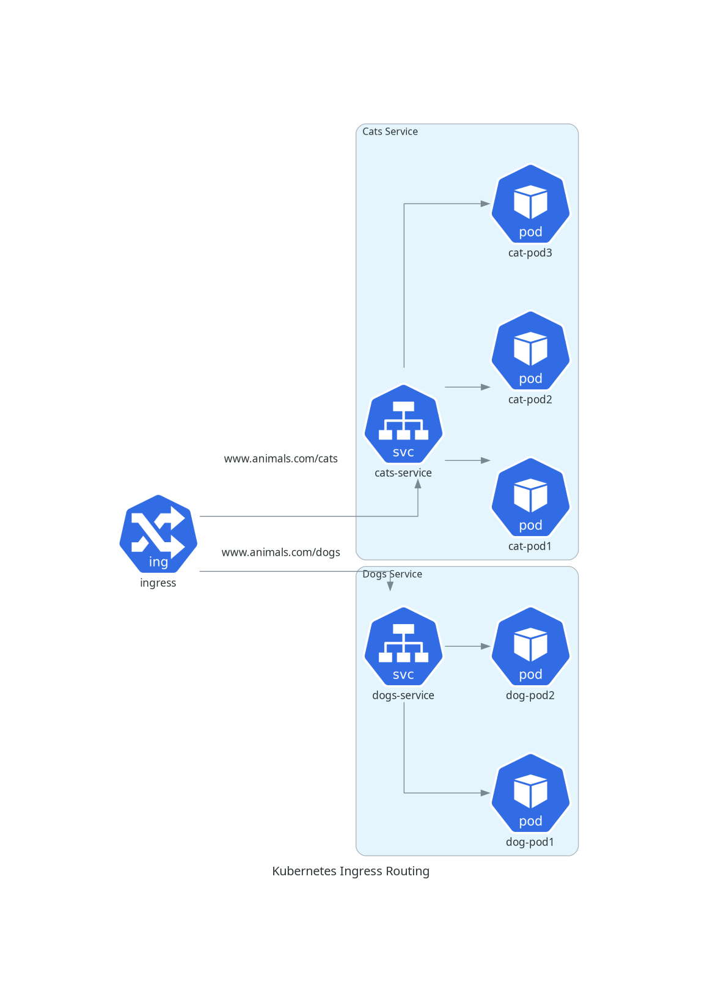

# Ingress routing to multiple services
In this example we will take advantage of the full potential of Ingress. Ingress can route different paths to different services. 
Two web services will be created and routed to different paths on the same IP host (the cluster).

## Exaplanation
To differentiate the two services we will set different web pages that will be served, these are stored in configMaps and then passed to the Pods as configuration files.
Two services and two configMaps are created, the configMaps are used to pass the web pages to the pods as configuration files (there are also other methods to do this, like using Volumes).
Finally the Ingress is set up to route the requests to the correct service based on the path.
```yaml
rules:
    - host: www.animals.com
      http:
        paths:
          - path: /dogs
            pathType: Prefix
            backend:
              service:
                name: dogs-service
                port:
                  number: 80
          - path: /cats
            pathType: Prefix
            backend:
              service:
                name: cats-service
                port:
                  number: 80
```
The host is set to `www.animals.com`, then the Ingress will route the requests to `dogs` to the dogs' service and the requests to `cats` to the cats' service.
A key element in the Ingress' configuration is the `annotations` section, in which is specified `nginx.ingress.kubernetes.io/rewrite-target: /` so that before the redirection to the service the path is rewritten to just `/`. This is necessary because otherwise the resource requested would include the "dogs" or "cats" paths and the web server would look for `/dogs/index.html` inside the containers file system.
<br>
The resulting system will look like this:

<br>
Alternatively, one can use name-based virtual hosting to route multiple host names to the same IP.
```yaml
  rules:
  - host: dogs.animals.com
    http:
      paths:
      - pathType: Prefix
        path: "/"
        backend:
          service:
            name: dogs-service
            port:
              number: 80
  - host: cats.animals.com
    http:
      paths:
      - pathType: Prefix
        path: "/"
        backend:
          service:
            name: cats-service
            port:
              number: 80
```
Check the [documentation](https://kubernetes.io/docs/concepts/services-networking/ingress/#types-of-ingress) for all the types of Ingress that can be deployed.

## Usage

### Prerequisites
Before running the example, make sure you have enabled the Ingress addon in Minikube:
```bash
minikube addons enable ingress
```

### Deployment and verification
Then, apply the configuration files:
```bash
kubectl apply -R -f manifests
```
After applying the configuration, you can check the status of the services and Ingress:
```bash
kubectl get all
```
Then enable the tunnel to access the Ingress from outside the cluster:
```bash
minikube tunnel
```
Now you can request the web pages using the following command:
```bash
curl --resolve "www.animals.com:80:127.0.0.1" -i http://www.animals.com/cats
# and
curl --resolve "www.animals.com:80:127.0.0.1" -i http://www.animals.com/dogs
```
### Cleaning up
To clean up use the `cleanup.sh` in the `scripts` directory:
```bash
./cleanup.sh
```